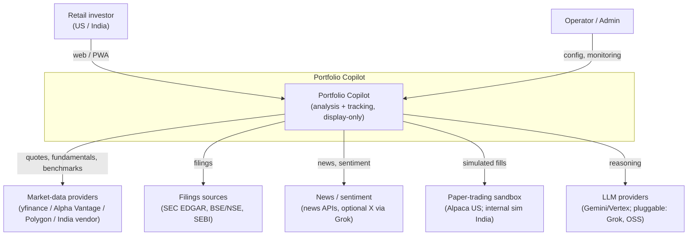
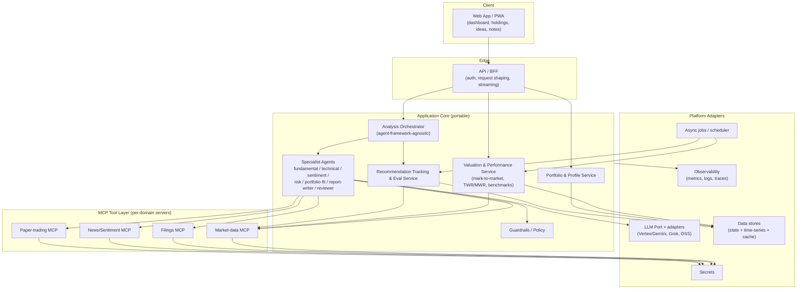
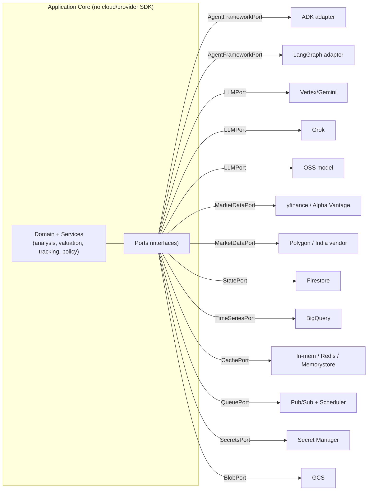
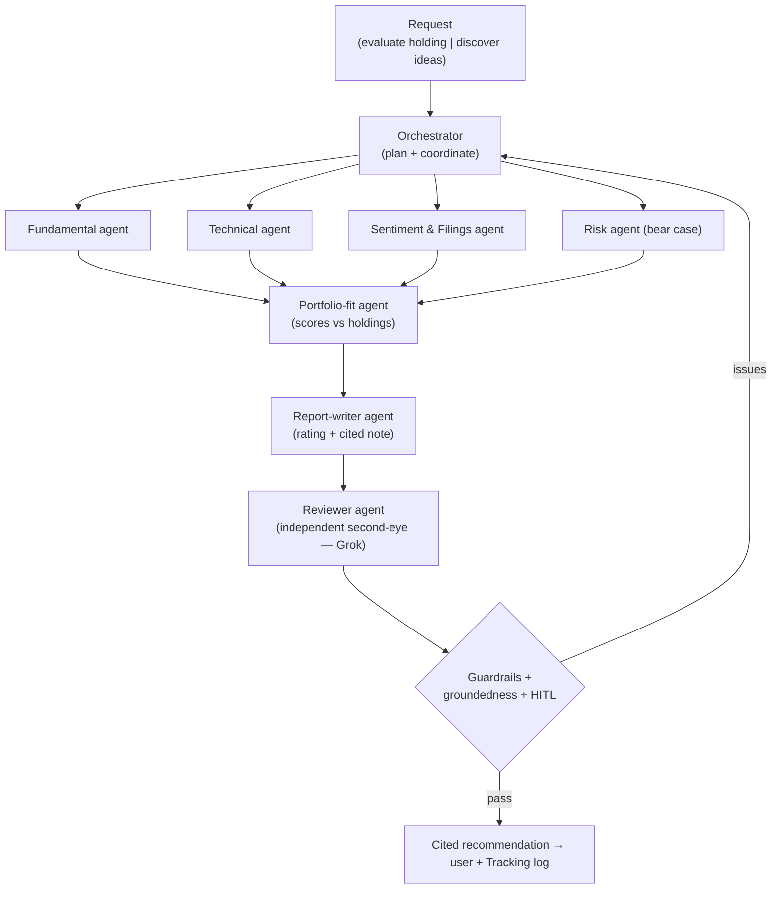
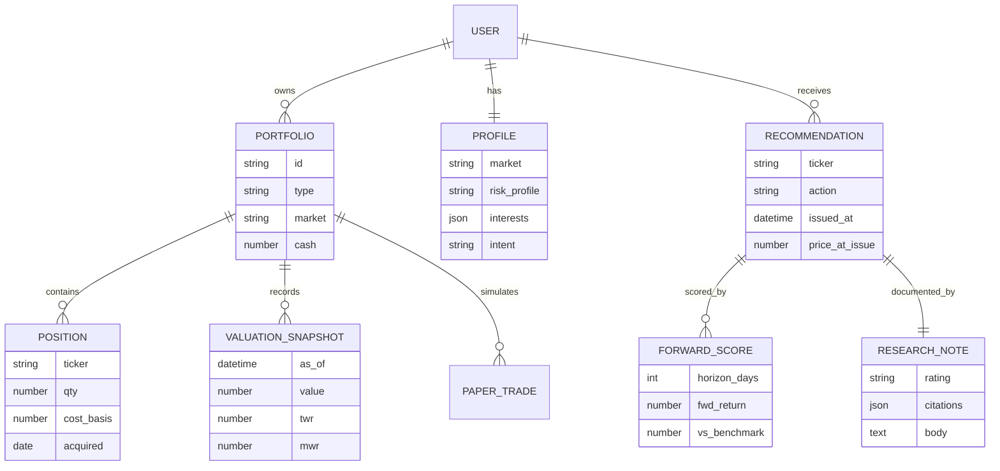
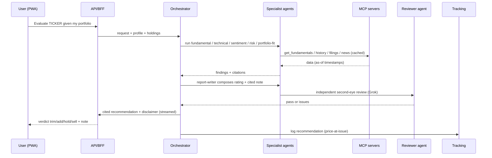

# Portfolio Copilot — Technical Architecture

**Document:** Technical Architecture
**Version:** 0.1 (draft)
**Last updated:** 11 August 2026
**Status:** Draft for review
**Related documents:** Requirements (`docs/requirements/Portfolio-Copilot-Requirements.md`, v0.2); One-Pager (`docs/product/Portfolio-Copilot-One-Pager.md`); Multi-Agent Engineering Protocol v4.0 (`chandra-prompts/`). ADRs will be written per-decision during implementation (protocol §7.1, §7.5).

> **Positioning & disclaimer.** Portfolio Copilot is **display-only**: it never executes real trades and never moves real money. All outputs are informational and **not investment advice**. This constraint is architectural — no component is permitted to place, route, or simulate-into-real any order.

---

## 1. Purpose & Scope

This document describes the technical architecture for Portfolio Copilot: the system decomposition, module boundaries, the agentic analysis engine, the MCP tool layer, data and valuation subsystems, cross-cutting concerns, and the GCP-now / cloud-agnostic deployment model. It is the whole-system design that individual ADRs and implementation phases build against. It does not fix vendor choices that are deferred to design spikes (§16) or to ADRs.

## 2. Architectural Principles

These principles are traceable to `requirements.md` and govern every decision below.

1. **Display-only, safety-first** — no execution path to real money exists anywhere (Req §3, §11, F7, F35, F51).
2. **Agents only where judgment is needed** — LLM-driven agents for reasoning; deterministic services for data, math, valuation, and logging (F22).
3. **Modular by construction / ports-and-adapters** — every capability sits behind a stable interface; any module (agent, MCP server, store, provider) is replaceable without rewriting others (F54).
4. **No cloud SDK in core logic** — infrastructure and providers live behind adapters; core domain is portable (F55, F56).
5. **Pluggable providers** — model, market-data, filings, and news providers are configuration-selectable, enabling open-source/free-first → paid upgrade with no consumer code change (F57).
6. **Evaluated, not just tested** — non-determinism handled via eval sets and acceptance criteria, not one-off unit tests (A1).
7. **Cost- and freshness-aware** — mandatory caching, per-request budgets, data-as-of markers (F38, F39, A3).
8. **Grounded & guardrailed** — citations required; untrusted tool output is data, never instructions (F26, F50, A2, A6).
9. **Scale-ready, not over-built** — stateless services and clean data partitioning so the design can grow to millions of users without a v1 rewrite (NFR Scalability).

## 3. System Context (C4 — Level 1)



Actors: the **retail investor** (US or India) and an internal **operator/admin** (Req §4). External systems are all reached through adapters (§6), never directly from core logic.

## 4. High-Level Architecture (C4 — Level 2, Containers)



Container responsibilities:

- **Web App / PWA** — dashboard, holdings, ranked ideas, cited notes; installable/offline-tolerant (F45–F48, F53).
- **API / BFF** — authentication, per-user isolation, request shaping, response streaming. Thin transport layer (no business rules; cross-cutting concerns live in services, protocol §5.16).
- **Analysis Orchestrator** — plans and coordinates the specialist agents; framework-agnostic (see §7).
- **Specialist Agents** — the reasoning units, including the runtime **Reviewer agent** (§7.3).
- **Valuation & Performance Service** — deterministic mark-to-market, TWR/MWR, benchmark comparison (F10–F16).
- **Portfolio & Profile Service** — holdings, cash, profile, multiple portfolios (F1–F9).
- **Recommendation Tracking & Eval Service** — logs recommendations, scores forward returns, feeds the eval harness (F29–F32).
- **Guardrails / Policy** — disclaimers, prompt-injection defense, refusal, display-only enforcement (F49–F52, A2).
- **MCP Tool Layer** — per-domain data/tool servers (§8).
- **Platform Adapters** — the only place cloud/provider SDKs appear (§6, §14).

## 5. Runtime vs Build-time (important distinction)

Two separate agent systems, never conflated:

- **Build-time** — the Strategist / Coordinator / Worker / Reviewer agents of the Multi-Agent Engineering Protocol v4.0 *build* this product.
- **Runtime** — the orchestrator + specialist agents described here *are* the product, executing when a user makes a request.

Grok appears in both, in analogous but distinct roles: a **build-time Reviewer** (protocol §1.6) and a **runtime Reviewer agent** (§7.3). They share a philosophy (independent second-eye) but are different systems.

## 6. Modular Boundaries — Ports & Adapters (Hexagonal)

The cloud-agnostic and pluggability requirements (F54–F57) are realized with a ports-and-adapters (hexagonal) structure. The **application core** (domain logic, orchestration contracts, services) depends only on **ports** (interfaces). Concrete **adapters** implement those ports for a specific provider or cloud. Swapping a provider = swapping an adapter; the core never changes.



Key ports (interfaces the core defines and depends on):

| Port | Purpose | v1 adapter (free-first) | Alt adapters |
|---|---|---|---|
| `AgentFrameworkPort` | run an agent / orchestrate sub-agents | ADK **and** LangGraph (spike, §16) | either becomes primary via ADR |
| `LLMPort` | chat/completion, tool-calling | Gemini (Vertex free tier / OSS local) | Grok, other OSS |
| `MarketDataPort` | quotes, history, fundamentals, benchmarks | yfinance / Alpha Vantage free | Polygon, FMP, India vendor |
| `FilingsPort` | fetch/normalize filings | SEC EDGAR + BSE/NSE public | licensed vendor |
| `NewsPort` | news, ratings, sentiment | free news API; optional X via Grok | paid news |
| `StatePort` | user/profile/portfolio state | Firestore | Postgres/Mongo |
| `TimeSeriesPort` | valuations, recommendations, eval | BigQuery | Postgres/ClickHouse |
| `CachePort` | data/response cache | in-memory → Memorystore | Redis |
| `QueuePort` / scheduler | async jobs, cadence | Pub/Sub + Cloud Scheduler | Kafka/SQS + cron |
| `SecretsPort` | provider credentials | Secret Manager | Vault |
| `BlobPort` | exported notes/artifacts | GCS | S3/MinIO |

This table is the concrete contract behind F55–F57: the middle column is what v1 wires; the right column proves portability by design (F56).

## 7. Agent Architecture (the analysis engine)

### 7.1 Framework abstraction

The orchestrator and agents are written against `AgentFrameworkPort`, not against ADK or LangGraph directly. Two adapters are built in v1 so we can **prototype both and learn** (per your decision, §16). ADK is the leading candidate given GCP-native Vertex/Gemini integration; the final selection is an ADR after the spike. Whichever wins, the other adapter remains as portability proof and a fallback.

### 7.2 Agent topology



- **Orchestrator** — decides which analyses to run for the request, sequences specialists, and assembles results. Deterministic control where possible; LLM planning only where genuinely dynamic (F21, F22).
- **Specialist agents** — fundamental, technical, sentiment & filings, risk (bear case), portfolio-fit (the differentiator, F20), report-writer (F17–F25).
- **Reviewer agent (runtime second-eye)** — an independent, different-model critic that reviews the report-writer's output for unsupported claims, missing citations, over-confidence, and portfolio-fit errors before it is shown. Grok is the intended model here, behind `LLMPort` so it is swappable and optional. Findings either pass the note through or loop back to the orchestrator. This operationalizes A6 (groundedness) and mirrors the protocol's independence philosophy at runtime. Because it adds latency/cost, it is applied by depth/risk tier (quick vs deep mode, F24) and is configuration-toggleable.

### 7.3 Grounding & citations

Every material claim carries a citation to a retrieved source (F26). The report-writer must attach source references from tool outputs; the reviewer agent flags any claim lacking grounding (A6). Ungrounded claims are withheld or marked, never silently emitted.

## 8. MCP Tool Layer

Per-domain MCP servers (F40), each exposing typed tools the agents call. Focused servers, not a monolith, so each deploys/scales/fails independently (F43).

- **Market-data MCP** — `get_quote`, `get_price_history`, `get_fundamentals`, `get_benchmark_series`. Holds provider key (F41), enforces cache + rate-limit + semantic error mapping (F42; protocol §5.15, §5.24).
- **Filings MCP** — `search_filings`, `get_filing`, normalized across SEC EDGAR and BSE/NSE/SEBI (F44 — the custom, reusable server).
- **News/Sentiment MCP** — `get_news`, `get_ratings`, optional `get_social_sentiment` (X via Grok).
- **Paper-trading MCP** — `simulate_order`, `get_paper_positions`; **US** via Alpaca paper sandbox, **India** via internal fill simulation. Hard-wired to simulation only — no real-order capability exists (F33–F35).

Transport: **stdio** (local subprocess) in dev; **HTTP/SSE** service (own Cloud Run deployment) in prod (F43). Untrusted content returned by these servers is treated as data, never instructions (A2, F50).

## 9. Data Architecture



Store mapping (behind ports, §6):

- **State (`StatePort` → Firestore)** — users, profiles, portfolios, positions, current holdings. Low-latency reads for the dashboard; per-user isolation enforced (NFR Security).
- **Time-series / analytical (`TimeSeriesPort` → BigQuery)** — valuation snapshots, recommendations, forward scores, eval sets, LLM/tool traces. Enables charts, benchmark comparison, and offline eval at scale.
- **Cache (`CachePort`)** — market-data and analysis-result caching to bound cost/latency (F38).
- **Blob (`BlobPort` → GCS)** — exported research notes/PDFs (F28).

## 10. Valuation & Performance Subsystem (deterministic)

- **Mark-to-market (F10)** — on-demand (dashboard/request) and scheduled (via `QueuePort` + scheduler, e.g., end-of-day) valuation; each run writes a `VALUATION_SNAPSHOT`.
- **Returns (F13)** — computes **TWR** (for fair benchmark comparison, neutralizing cash-flow timing) and **MWR/IRR** (the user's personal return); both stored and labeled.
- **Benchmark comparison (F12, F14)** — pulls S&P 500 / Nifty 50 / BSE 100 series via the market-data MCP; compares over matching windows for **both real and paper** portfolios.
- Entirely deterministic services — no LLM involved (F22).

## 11. Recommendation Tracking & Evaluation Subsystem

- **Logging (F29)** — every issued recommendation persisted with timestamp, price-at-issue, market, and a link to its research note.
- **Forward scoring (F30)** — scheduled jobs score recommendations against actual forward returns at 7/30/90-day horizons; results stored as `FORWARD_SCORE`.
- **Eval harness (F31, A1)** — the accumulated recommendation+score dataset, plus curated offline eval sets, drives regression testing of the analysis engine. "Passed once" is never sufficient; changes are evaluated against these sets.
- **Track record (F32)** — honest, non-misleading user-facing summary (e.g., hit rate vs benchmark).

## 12. Representative Request Flow — "Evaluate a holding"



## 13. Cross-Cutting Concerns

- **Security & isolation** — per-user data isolation; provider keys only inside MCP servers/Secret Manager; keyless identity (WIF for CI, ADC/SA-impersonation at runtime — protocol §4.8, §5.13). Read-only broker scopes only (F8).
- **Guardrails & prompt-injection** — untrusted tool output is data, not instructions (A2, F50); disclaimers on every output (F49); refusal for out-of-scope asks (F52); no guarantee/execution language (F51).
- **Observability** — metrics, logs, and per-request agent traces (tool calls, tokens, latency, cost) without leaking PII (NFR Observability, A3); data-freshness and cache-hit metrics per MCP server.
- **Cost control** — mandatory caching, per-request token budgets, model-tier selection by depth (A3, F24, F38).
- **Configuration & feature flags** — provider selection and the reviewer-agent toggle are config-driven (F57); env-var/config contracts codified, not ambient (protocol §5.32).
- **Human-in-the-loop** — confirmation before any simulated paper action (F36, A4).

## 14. Deployment & Cloud-Agnostic Model

**v1 on GCP** (behind the ports of §6):

| Concern | GCP service (v1) | Port |
|---|---|---|
| App / BFF / MCP servers | Cloud Run | — |
| LLM | Vertex AI (Gemini) | `LLMPort` |
| State | Firestore | `StatePort` |
| Analytical / time-series | BigQuery | `TimeSeriesPort` |
| Cache | Memorystore (or in-mem in dev) | `CachePort` |
| Async / schedule | Pub/Sub + Cloud Scheduler | `QueuePort` |
| Secrets | Secret Manager | `SecretsPort` |
| Blob | GCS | `BlobPort` |
| Observability | Cloud Logging/Monitoring/Trace | `Obs` |

Because everything is reached through ports, an alternate cloud is an adapter set (e.g., ECS/Fargate + Bedrock + DynamoDB + S3 + SQS), with no change to the application core (F55). Portability is proven by keeping at least the `LLMPort` and a store port with a documented second adapter (F56).

## 15. Scalability & Performance

- **Stateless services** behind a load balancer; horizontal autoscale per container (Cloud Run) — app, orchestrator, and each MCP server scale independently (NFR Scalability).
- **Data partitioning** by user; Firestore for hot state, BigQuery for high-cardinality analytical/time-series — designed for millions of users without redesign.
- **Async offload** — valuation and forward-scoring run as scheduled/queued jobs, not in the request path.
- **Caching tiers** — market-data cache (shared) + analysis-result cache; bounds provider cost and tail latency (F38).
- **Streaming** — analysis streams progress so deep mode stays responsive (NFR Performance, F45).

## 16. Framework Prototype / Spike Plan (ADK vs LangGraph)

Per your preference to prototype both for learning, before committing:

- Build the same minimal slice (one specialist agent + orchestrator calling one MCP tool) against **both** the ADK and LangGraph adapters of `AgentFrameworkPort`.
- Compare on: developer ergonomics, orchestration/multi-agent support, state/checkpointing, streaming, tracing/observability, Vertex/Gemini integration, testability, and portability cost.
- Output: a comparison note + an **ADR** selecting the primary framework. The non-primary adapter is retained as portability proof (F56). This keeps the core untouched regardless of outcome.

## 17. Technology Choices (v1 — open-source / free-first)

Provider-agnostic by design (F57); v1 favors free/OSS tiers, upgraded later behind the same adapters.

- **Language/runtime:** Python (agents, services, MCP servers).
- **Models:** Gemini free tier / local OSS models in dev; Grok for the reviewer agent (behind `LLMPort`).
- **Market data:** yfinance / Alpha Vantage free; SEC EDGAR + NSE/BSE public for filings.
- **Frameworks:** ADK and LangGraph (spike) behind the port.
- **Stores:** Firestore + BigQuery (GCP free tiers) — swappable.
- **Infra:** Cloud Run + Terraform (keyless CI via WIF, protocol §4.8).

## 18. Proposed Repository / Module Structure

Aligned with the engineering protocol (docs/adr, docs/runbooks, docs/backlog, CHANGELOG).

```
portfolio-copilot/
  docs/            requirements.md, architecture.md, one-pager.md, adr/, runbooks/, backlog.md
  core/            domain + services (no cloud/provider SDK)
    analysis/      orchestrator, agents, reviewer
    valuation/     mark-to-market, TWR/MWR, benchmarks
    portfolio/     profile, holdings
    tracking/      recommendation logging, forward scoring, eval
    ports/         interfaces (AgentFramework, LLM, MarketData, State, ...)
  adapters/        concrete implementations per provider/cloud
    agent_adk/  agent_langgraph/  llm_vertex/  llm_grok/  store_firestore/ ...
  mcp/             market_data/  filings/  news/  paper_trading/
  api/             BFF / gateway
  web/             PWA dashboard
  infra/           terraform, cloud run, CI (WIF)
  eval/            eval sets + harness
```

## 19. Architectural Decisions → ADRs (to be written during implementation)

Per protocol §7.1/§7.5, these are genuine decisions-with-alternatives, captured as ADRs when their phase lands:

1. Agent framework selection (ADK vs LangGraph) — after the §16 spike.
2. State vs analytical store split (Firestore + BigQuery) and data model.
3. Runtime reviewer-agent design (propose-review-gate) and when it runs (risk/depth tier).
4. MCP server boundaries and transport (stdio dev / HTTP prod).
5. TWR/MWR presentation and India default benchmark (Nifty 50 vs BSE 100).
6. Caching strategy and cost-budget policy.
7. Prompt-injection / guardrail approach for ingested filings & news.

## 20. Requirements Traceability (major components → requirements)

| Component | Requirements |
|---|---|
| Orchestrator + specialist agents | F17–F24, F21, A1–A6 |
| Portfolio-fit agent | F20 |
| Runtime reviewer agent (Grok) | A6, F26 (grounding), aligns with protocol §1.6 philosophy |
| MCP tool layer | F40–F44, F41 (key isolation), A2 |
| Valuation & performance | F10–F16 |
| Recommendation tracking & eval | F29–F32, A1 |
| Ports & adapters / modularity | F54–F57, NFR Deployment |
| PWA / dashboard | F45–F48, F53 |
| Guardrails / policy | F49–F52, A2, A4 |
| Deployment (GCP-now, portable) | NFR Deployment, F55, F56 |
| Scalability design | NFR Scalability |

## 21. Open Items (carried from requirements §13)

India market-data provider selection; TWR-vs-MWR primary; India default benchmark; log granularity/retention; final framework selection (via §16 spike/ADR); real-holdings read-only sync scope and phase.

---

*Next document: Implementation Phases (multi-week roadmap). ADRs are authored per-decision as their phases land, per Multi-Agent Engineering Protocol v4.0.*
